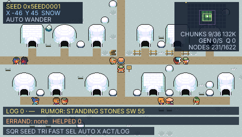

# pocketjs-wander

An endless grown world that streams in around the player, running on
[PocketJS](https://github.com/pocket-nexus/pocketjs) (desktop, web, devices)
and built with [Pocket RPG Kit](https://github.com/lfkdsk/pocketjs-rpgkit).
Towns grow as you reach them; landmarks, rumors and errands wait in the
wilds; and when you put it down, the world wanders itself. Wander Online
adds GitHub sign-in, character creation and a hosted shared world.

Play [Wander](https://lfkdsk.github.io/pocketjs-wander/) or
[Wander Online](https://lfkdsk.github.io/pocketjs-wander/wander-online/)
in the browser.

| A grown town beside a snow border (sim golden) | On the desktop host, walking to a clicked tile |
| --- | --- |
|  |  |

## Run it

```sh
bun run setup        # submodules (Pocket RPG Kit + PocketJS) and dependencies
bun run build:wasm   # the PocketJS core the sim host and web build use
bun run build        # wander and wander-online bundles + paks (dist/)
bun run desktop      # wander in a desktop window (add wander-online for the demo)
bun run web          # both browser-playable apps in dist/web
```

Serve `dist/web` with any static file server and open the wander page.
DPAD walks; any key takes over from the auto-walk and 10 idle seconds hand
it back; TRIANGLE toggles fast travel, SQUARE rolls a new seed, CIRCLE reads
a town's notice board. Click or tap a tile to walk there.

The world, its residency and the auto-walk trajectory are deterministic at
60/30/20/4 Hz: two runs agree tick for tick, and a serialize/restore round
trip continues the same session (pinned by `tests/wander-f1.test.ts` and
`tests/wander-f2.test.ts`).

## Wander Online

Wander Online shares one real Wander window between an authoritative server
(20 Hz, 10 Hz area-of-interest snapshots) and clients with prediction,
rollback-and-replay reconciliation, and 100 ms remote interpolation. The
published web app signs in with GitHub, exchanges the one-use OAuth token for
a session ticket, and lets a new player choose a name and one of 64 looks.
Desktop players can link the same profile with a six-digit code. The page's
bilingual Sign out control uses the same credential-clearing path as the game,
player names stay above world art, and the HUD shows both current-room and
whole-service presence as `ROOM n · ALL m`.

For local development, start the loopback-only Bun server with its explicit
guest switch, then launch clients with matching guest credentials:

```sh
bun run examples/wander-online/server/server.ts --allow-guests
bun run desktop wander-online --guest demo
bun run web
```

`bun run online:demo` runs the local acceptance demo — two desktop hosts and
a browser tab seeing each other, a 150 ms latency phase, a server restart,
and a 100-bot load phase — and writes screenshots plus a JSON summary. See
[`examples/wander-online/README.md`](examples/wander-online/README.md) for
the authentication flow, protocol, demo phases and hosted deployment.

## Layout

- `examples/wander/` — the endless world: pure chunk generation
  (`chunk.ts`, `region.ts`, `world.ts`), focus-driven residency
  (`residency.ts`), the streaming window (`window.ts`), the auto-walk
  driver (`driver.ts`), towns, landmarks, errands and the travel log, the
  pooled-node renderer (`wander-render.ts`, `WanderView.tsx`), and the
  deterministic simulation (`wander-sim.ts`) that live play and replays
  share.
- `examples/wander-online/` — the multiplayer demo: protocol, prediction
  and interpolation (`net/`), the authoritative server (`server/`), the
  runtime-agnostic shared logic (`shared/`, also used by the Cloudflare
  deployment) and the acceptance demo (`demo.sh`, `web-check.ts`).
- `tests/` — the suites: per-tick contracts, the F1/F2 feature sweeps,
  looks, HUD, rendering goldens, and the online client/server/net/shared
  suites. `tests/goldens/` holds the pinned frames.
- `tools/` — build / desktop / web wrappers, evidence-shot tools and the
  reproducible Wander Online QuickJS benchmark.
- `docs/status.md` — the current Done / Partial feature checklist.
- `vendor/pocket-rpgkit/` — the Pocket RPG Kit submodule: the engine and UI
  modules the world is built with, the grow example's art it draws, and the
  PocketJS checkout nested inside it.

## Relationship to the other repos

- **[pocketjs-rpgkit](https://github.com/lfkdsk/pocketjs-rpgkit)** — the
  reusable RPG runtime. wander imports its engine (`session`, `passability`,
  `motion-clock`, `movement`, `interpreter`, `clone`) and UI (`DialogBox`,
  `PlayerSprite`, `TileTextureCache`) through the submodule, and draws the
  rule-grown settlement's committed art from `examples/grow/` in place.
  This repo was split out of pocketjs-rpgkit with its history; the engine
  and grow stay there.
- **[pocket-online-server](https://github.com/lfkdsk/pocket-online-server)**
  — the Cloudflare Workers + Durable Objects deployment. It vendors this
  repository and imports the runtime-agnostic authentication, arena,
  snapshot, admission-limit and monthly-budget modules in place.

## License and attribution

Code: MIT, see [LICENSE](LICENSE). Art: CC0 (Ninja Adventure Asset Pack —
Pixel-Boy and AAA) and CC-BY 3.0 (Lanea Zimmerman (Sharm), "Tiny 16", via
OpenGameArt.org), with generated composites dedicated under CC0. Full
provenance in [ATTRIBUTION.md](ATTRIBUTION.md).
